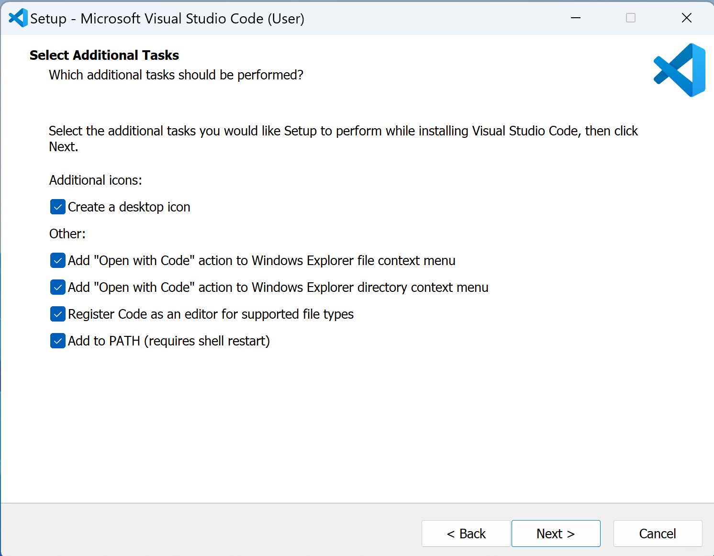
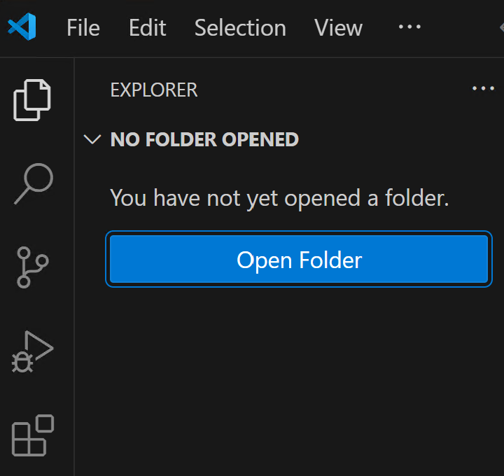

# Git && GitHub Workshop

UB IEEE x DREAM 

---

## Installing Git

### Verifying Installations

You may already have git installed on your computer!

Open a terminal, and try typing:
 ```shell
 git --version
 ``` 
 
 If you are using a mac, also try:
  ```bash
  Git --version
  ```

  If you already have a working version of git on your system, you do not have to install it again. 

---
### Windows

There are two primary methods for installing git on Windows: the regular executable installer, and winget. While most of you are probably not familiar using a CLI package manager, you should start to get familiar with them. We recommend using winget. 

#### Executable GUI Installer

Go to https://git-scm.com/download/win and download the installer. 

#### Using Winget

Open a PowerShell terminal. Use the following command: 
```powershell
 winget install --id Git.Git -e --source winget 
```
---
### macOS

There are a variety of ways to install git on macOS. We recommend that you use [homebrew](https://brew.sh/). 

#### Homebrew setup

##### Installing Brew

Try to see if you have brew installed by opening a terminal and typing `brew help`. If you do not have homebrew on your system, install it by typing this command in your terminal:
```shell
/bin/bash -c "$(curl -fsSL https://raw.githubusercontent.com/Homebrew/install/HEAD/install.sh)"
```

---
##### Installing Git with Brew
Type the following in your terminal:
```shell
brew install git
```

#### XCode

Git can be installed with a properly configured XCode installation by typing the command `xcode-select --install`. Since I don't use a mac, I can't confirm this or help you out. Sorry!

---
### Debian/Ubuntu

Type the following command in your terminal:
```bash
sudo apt install git
```

### Fedora

```bash
sudo dnf install git
```

### Arch

```bash
pacman -S git
```

### Others

If you are using another Linux distro, please see: https://git-scm.com/downloads/linux. 

---

## Installing VSCode


Visual Studio Code is a powerful text editor. VS Code's powerful and popular extension ecosystem can give it many of the powers of a fully-fledged IDE. VSCode also has the ability to take care of GitHub credentials so that you can access remote GitHub repositories without needing to create an SSH key. You can download Visual Studio Code from here: https://code.visualstudio.com/download. 


---

When installing VSCode, it is usually preferable to select all of the options that the installer gives you.


---

### Aside on GitHub Credential Management
It is important to note that you can use git and GitHub using any text editor or IDE of your choosing as long as you have access to an integrated terminal or the external terminal application that comes with your OS (such as Powershell on Windows, or just Terminal on Linux and macOS). 

The reason this tutorial will be using VSCode is because VSCode and GitHub are both owned by Microsoft, and have the ability to take care of our GitHub credentials for us. This will make it faster and easier to get started, although it is not best to have VSCode manage your GitHub credentials. Using an ssh key or personal access token to access your GitHub account is much better than letting VSCode handle your credentials. Using ssh keys or access tokens provide for greater portability and security. However, since this is a beginner tutorial with a tight time limit, we won't be teaching you how to use these today. If you want to learn how to use these methods, please check out [GitHub's documentation for using ssh keys](https://docs.github.com/en/authentication/connecting-to-github-with-ssh) or [GitHub's documentation for using personal access tokens](https://docs.github.com/en/authentication/keeping-your-account-and-data-secure/managing-your-personal-access-tokens).


---

## GitHub Account

Please go to https://github.com/ and create a GitHub account if you do not already have one. We recommend using your personal email address, not your school email. Regardless, you should be able to change the email associated with your account later. 


---

## Learning Git

### Verifying Git Installation

Before we continue, please make sure that git was installed installed properly. Open a _new_ terminal and type:
```
git --version
```

This command should respond without an error. 

---

### Creating Project Directory

Locate or create a directory (a folder) in which you would like to keep this project. For example, I keep a directory called `Projects` in my home directory for all of my programming projects. 

> The name and location of this directory are not that important, with two exceptions: 
> 1) The folder should not be inside a preexisting git repository
> 2) The folder should not be inside a cloud storage folder such as Google Drive, OneDrive, Dropbox, or iCloud. 

In this case, my directory would look something like this: `~/Projects/GitGitHubWorkshop`. 

---

```
home/
    ├── Projects/
    │   ├── One_of_my_projects/
    │   └── GitGitHubWorkshop/
    │       └── README.md
    ├── Downloads/
    │   └── file.txt
    ├── Downloads/
    └── Desktop/
```

> Technically it is possible to have a git repository inside of another git repository, but this is generally not a good idea. Nested git repositories can cause issues with tracking changes to files, and are an advanced topic. **Do not create a git repository inside of another git repository.** If you do, we will not help you.

---

### Opening Project Directory
Open up the directory you just created using VSCode. You can do this by opening VSCode and using the `Open Folder` or `Open Directory` button under the file explorer. 



If you have VSCode added your you `PATH`, you could also `cd` into that directory and use the command `code .` on Windows or `code . &` on UNIX. 

---

### Initialize Git Repo

Open up the integrated terminal in VSCode. This can be done using the GUI or with ``CTRL+Shift+` ``. Then type the command `git init`. It should look something like this on UNIX:
``` shell
user@machine:~/Projects/GitGitHubWorkshop$ git init
```

or 
```powershell
PS C:\Users\user\Projects\GitGitHubWorkshop> git init
```

on Windows. 

---

Now type the command `git status`, to verify that you successfully initialized a git repository in this directory. This is a command that you will use frequently, and should perform  every time after you initialize a git repo. 

Hopefully you will get some output saying something like this:

```
On branch main

No commits yet

nothing to commit (create/copy files and use "git add" to track)
```

---

### Create README.md File

Markdown is a popular description language that allows programmers to write documentation in simple language that is then compiled into [HTML](https://en.wikipedia.org/wiki/HTML). As a programmer it is important that you learn how to read and write Markdown (denoted by the .md extension). There are good examples at https://www.markdownguide.org/basic-syntax/. 

Type this exactly for your README.md:
```md
# <title-of-document> 

Author: <your-name>
Date: <the-current-date>

```

--- 

### The Stage and Making Commits

Git is a version control system to track changes to files. Each iteration in changes to files that git tracks is called a "commit". If desired, a user can easily revert the state of the project back to a commit at any time. 

Before creating a commit, you must first add all of the changes you want to be included in the commit to the "stage". 




<!-- Created this diagram with mermaidJS -->

---

#### Adding File Changes to Stage

To add our README.md to the stage, use the command `git add README.md`. 

After adding the README to the stage, type the command `git status`. 


---

#### Making a Commit

It is now time to commit the changes we added to the stage. To commit changes you use the command `git commit -m <commit-message>`. 

Every commit that you make in git will include certain fields such as the author, time, and message describing the contents of the commit. The `-m` flag tells `git-commit` to use the provided text as the commit message. 

In this example, we can commit the staged changes like so: 

`git commit -m "Added the README.md"`. 

If you use `git status` now, you should be informed that there are no untracked changes. 

--- 

#### Adding Files to Stage, Part 2

Now lets see how adding and making changes to multiple files works with git. 

Go on the internet on locate a picture in the `.svg`, `.png`, or `.jpeg` format that you would like to include in your document. Then create a new directory in your repository and place that image inside of it. 

If you named your new directory `images` and downloaded the file `victor_e_bull.jpg`, your directory structure would now look like so:


```
GitGitHubWorkshop/
    ├── images/
    │   ├── victor_e_bull.jpg
    └── README.md
```

---

Try modifying the README file to include actual information now, as well as include the image that you just found. It will look something like this:

```md
# UB Athletics

Author: Victor Bull
Date: 10/24/2024


```

Check the status now. It should show the you have a new untracked directory as well as changes made to the README. 

1) Use git to stage the images directory and image you added. Then, commit these using a meaningful commit message. Check that all of this worked using `git status`
2) After you have made a commit for the image, stage the change you made to the README and make a commit for that change. Check the status to ensure it worked.

---

### Git log and Commit Diagrams



It can be helpful to check what commits we have previously made on a branch. To do this, you can use the command `git log`. Use this command to verify that you have made three commits. 

> When the output of `git log` gets long it will take over your terminal so that you can scroll through your commit history. If this happens, you can escape this view and return your terminal by pressing `q`. 

---

### Branching, Merging, Checkout, and Resolving Conflicts

#### Creating a new Branch

You can create a branch of your current commit using the command `git branch <branch-name>`. 

If you then use the command `git branch -a`, you should be able to see all of the branches for your repository as well as the one you currently have checked out. 

The command `git branch` will not checkout the new branch you created by default, it will only create it. To go to the new branch use the command `git checkout <branch-name>`. 

To create a new branch and check it out with one command you can use the `-b` flag when using `git checkout`. This would be `git checkout -b <name-of-new-branch>`. 

---


---

##### Adding Content to Winnie Branch

1) Create a branch named `winnie-the-pooh` with `git branch winnie-the-pooh`. 

2) Check that the branch has been created using the command `git branch -a`

3) Checkout the new branch using the command `git checkout winnie-the-pooh`

4) Go on the internet and find an image of Winnie and replace the image you found earlier with this one. Make sure to commit this change. 

5) Modify the other contents of your README including the title and author and commit the changes. It should look something like this:

```md
# Favorite Cartoon Characters

Author: Winnie the Pooh
Date: 10/24/2024


```

---


---

##### Piglet Branch

1) Go back to the main branch by using the command `git checkout main`. 

2) Use the command `git checkout -b piglet` to create a new branch named `piglet` and immediately move to it. 

4) Go on the internet and find an image of Piglet and replace the image you found earlier with this one. Make sure to commit this change. 

5) Modify the other contents of your README including the title and author and commit the changes. Set the title to be the same that you used when you were making the `winnie-the-pooh` branch. It should look something like this:

```md
# Favorite Cartoon Characters

Author: Piglet
Date: 10/24/2024


```

---


---

<!-- Checkout main and merge first branch -->

#### Managing a Merge Conflict
```md
# Favorite Cartoon Characters

<<<<<<< HEAD
Author: Winnie the Pooh
Date: 10/24/2024


=======
Author: Piglet
Date: 10/24/2024


>>>>>>> piglet
```

---

##### Conflict Resolved
```md
# Favorite Cartoon Characters

Featured Characters: Winnie the Pooh, Piglet
Date: 10/24/2024


```

---


--- 

### The Hidden `.git` Directory

Open up the current directory and file explorer. You should see a directory named `.git` inside. If not, enable the setting in your file explorer to show hidden files. If using a UNIX shell, you might need to use the `-a` flag when using `ls`, such as `ls -a`. 

`.something` files or directories are known as "dot files", and are used as a convention for hidden directories or folders. By default, most file explorers will not display these the the user. You will often see dot files used for certain data storages that the user should not modify or for configuration files (such as the `.vimrc` for [Vim](https://en.wikipedia.org/wiki/Vim_(text_editor)) or the `.bashrc` for [Bash](https://www.gnu.org/software/bash/)). 

When you use the command `git init`, git is creating this hidden `.git` directory in the location you type the command. All the information that git uses to track your repository is stored in this `.git` directory. 

---

#### The Hidden `.git` Directory: Exercises

1) Rename the `.git` directory to something else, like `.renamed`. What happens when you check the status of the repository with `git status`?
2) Rename that directory back to `.git`, and then check the status. What happens?
3) Rename that directory again so that it is not a hidden directory, but still has the ".git" extension, such as `renamed.git`. What happens now when you check the status?
4) Rename that directory back to `.git`, and then check the status. What happens?
5) Manually delete the `.git` directory and check the status. 
6) Recreate (initialize) your default git repo by using the command we learned earlier. What is the status of this now? 
> Bonus Exercise: Open up the hidden `.git` directory in your file explorer and explore its structure and contents. 

--- 

## Using GitHub

---

### Uploading Repository to GitHub

---

#### Pushing Changes to GitHub

---

#### Collaborating With Others with GitHub

---

#### Creating a Pull Request

---

#### Reviewing Pull Request

---

## Additional <!-- Learning --> Resources

- Git Man Pages: Use `man git` on UNIX or `git help` anywhere with git installed
- Git Website: https://git-scm.com/
- GitHub Docs: https://docs.github.com/en
- Git Pro Book (Free): https://git-scm.com/book/en/v2
- Markdown Guide: https://www.markdownguide.org/
- VSCode Documentation: https://code.visualstudio.com/Docs
- GitLab (GitHub competitor): https://about.gitlab.com/
- Mercurial (Alternative Source Control Management Program): https://www.mercurial-scm.org/
- BitBucket (GitHub competitor that supports Mercurial and Git): https://bitbucket.org/


